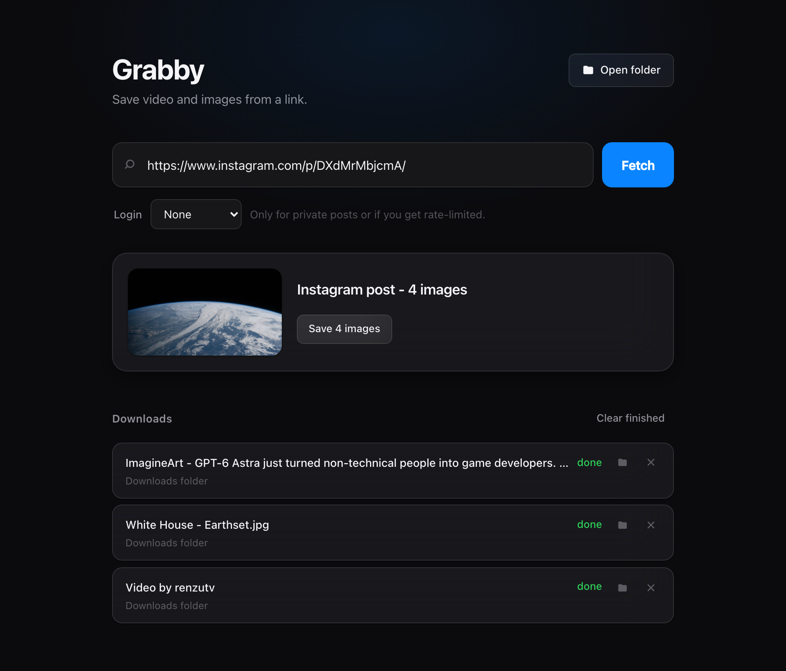

# Grabby

**Paste a link. Keep the file.**

A small, private desktop app for macOS that saves video *and* images from
YouTube, Instagram, X and LinkedIn. Built on
[yt-dlp](https://github.com/yt-dlp/yt-dlp), [gallery-dl](https://github.com/mikf/gallery-dl)
and ffmpeg.

Everything runs locally. Nothing is uploaded anywhere, there is no account, no
telemetry, and the server listens on `127.0.0.1` only.



## Supported sites

| Site | Video | Images | Needs a login? |
|---|---|---|---|
| **YouTube** | Videos and playlists, up to 4K | — | No |
| **Instagram** | Posts, reels, carousels | Photo posts and carousel photos, full resolution | Only for profiles and private accounts |
| **X / Twitter** | Videos up to 4K | Post images at original size | No |
| **LinkedIn** | Post videos | Post images at high resolution | No |

Anything else [yt-dlp supports](https://github.com/yt-dlp/yt-dlp/blob/master/supportedsites.md)
will usually work too — those four just get tailored handling.

**Public posts on all four work without logging in**, including Instagram
reels, carousels and photos. The Login menu is there for private profiles and
for listing a whole Instagram account.

## What it does

- Paste a link, see the title, channel, length and thumbnail before committing
- Pick a quality from the resolutions that video actually offers
- **Playlists and carousels** — a checklist of every item, untick what you
  don't want
- **Images** — photo posts and the photo half of a carousel, saved at full
  resolution
- **Instagram profiles** — list an account's posts and choose which to keep
- **Profile pictures** — save any Instagram account's avatar
- Audio-only mode extracts an mp3
- Three downloads run at once; the rest queue automatically
- Live progress with speed and time remaining
- Every finished item has **Show in Finder** — which reveals the actual file,
  not just the folder — and a **✕** that deletes it again if you grabbed the
  wrong thing
- Follows your system's light or dark appearance

## How files are organised

One post stays as one thing on disk. Single items sit at the top level;
anything with several parts gets its own folder, numbered in post order.

```
~/Downloads/yt-downloader/
├── Video by renzutv [DUl354timp1].mp4              ← single post
├── White House - Earthset.jpg                      ← single image
├── NASA no place like home [DXdMrMbjcmA]/          ← image carousel
│   ├── 01 - NASA no place like home.jpg
│   └── 02 - NASA no place like home.jpg
├── Post by instagram [BQ0eAlwhDrw]/                ← video carousel
│   ├── 01 - Video by instagram [BQ0dSaohpPW].mp4
│   └── 02 - Video by instagram [BQ0dTpOhuHT].mp4
└── renzutv [instagram]/                            ← a whole profile
    └── Video by renzutv [DUl354timp1].mp4
```

Names include the site's own id, so nothing silently overwrites anything else.

## Requirements

- macOS 11 or later (Apple Silicon or Intel)
- Xcode Command Line Tools — provides `git` and `clang`
- **Python 3.10 or newer**
- [ffmpeg](https://ffmpeg.org)

Two of those deserve a note.

**Python.** macOS only ships 3.9, which is too old — yt-dlp has deprecated it,
and it fails outright on this code. Install a current one with `brew install
python`. Grabby searches for a suitable interpreter on first launch and tells
you plainly if it can't find one; it will never silently build a broken
environment on the system 3.9.

**ffmpeg** is not optional. YouTube serves video and audio as separate streams
for anything above 720p, and they have to be merged.

## Install

```bash
git clone https://github.com/mirusman1k/grabby.git
cd grabby
./build/make_app.sh
```

That puts **Grabby.app** in your Applications folder. Launchpad, Spotlight and
the Dock all find it, and it opens in its own window — no Terminal, no browser
tab. First launch sets up a virtualenv automatically.

The app records the path it was built from, so **re-run `./build/make_app.sh`
if you ever move the folder.**

### Setting up on a new or wiped Mac

Everything Grabby needs is in this repo plus four commands:

```bash
xcode-select --install                                    # git + clang
/bin/bash -c "$(curl -fsSL https://raw.githubusercontent.com/Homebrew/install/HEAD/install.sh)"
brew install python ffmpeg
git clone https://github.com/mirusman1k/grabby.git && cd grabby && ./build/make_app.sh
```

First launch creates the virtualenv itself — no further steps. If the
environment is ever damaged, delete `.venv` and relaunch, or run
`./bootstrap.sh` directly to rebuild it.

### Updating

```bash
git pull && ./bootstrap.sh
```

`bootstrap.sh` reinstalls the dependencies from `requirements.txt`. You only
need to re-run `make_app.sh` if you *moved* the project folder — the installed
app runs the files in place, so a `git pull` is enough for new features.

### Prefer a browser tab?

```bash
./run.sh
```

Serves at <http://127.0.0.1:8000> and opens it for you.

### Always-on

```bash
./install-autostart.sh
```

Runs the server quietly from every login, so the address always works. Undo
with `./uninstall-autostart.sh`.

## Images

yt-dlp only handles video, so photo posts used to fail outright. Grabby reads
the picture side of a post itself and offers a **Save images** button whenever
there is one.

| Site | Where the images come from | Resolution |
|---|---|---|
| Instagram | The logged-out GraphQL post API | Original upload |
| X / Twitter | The public tweet-embed endpoint | `name=orig` |
| LinkedIn | `og:image` on the post page | `feedshare-image-high-res` |

A carousel's photos and videos are handled separately: the videos go through
the normal queue with quality selection, and the photos save in one click.
Both halves land in a folder named the same way. None of this needs a login.

Instagram's part depends on `curl_cffi`. Instagram serves that API only to
clients whose TLS handshake looks like a real browser — without impersonation
the same request returns the 600 KB web page instead of data. It installs with
the other requirements; if images start failing with *"Instagram returned its
web page instead of data"*, reinstall it.

## Downloading a whole profile

Paste `https://instagram.com/username`. You get the same checklist as a
playlist — untick anything you don't want — and every post lands in one folder
named for the account.

**This one needs a login.** Instagram returns `401 Unauthorized` for profile
listings to logged-out clients, with no exceptions; individual posts are
unaffected. Pick your browser in the **Login** menu before fetching.

Two things worth knowing:

- yt-dlp cannot list Instagram profiles at all — its `instagram:user` extractor
  is disabled upstream (`_WORKING = False`) because Instagram retired the
  GraphQL query behind it. Grabby shells out to gallery-dl for the listing
  only; yt-dlp still does every download, so quality, naming and progress are
  unchanged.
- Instagram rate-limits bulk reads, and doing this through your own session is
  a known way to get temporarily action-blocked. `MAX_PROFILE_POSTS` caps the
  listing at 200 newest posts by default.

## Profile pictures

Any Instagram post shows a **Save @username's profile picture** button.

Logged out you get the 150×150 thumbnail — that is genuinely all Instagram
returns, and the CDN URLs cannot be upscaled by editing them because the `oh=`
parameter signs the whole URL including the resize token. Set **Login** to your
browser for the full-size version. The button reports the size it actually got.

## Logging in

Leave the **Login** menu on **None** unless something fails. Public Instagram
reels, posts and photos, public LinkedIn posts and public X videos all download
anonymously.

You need a session only for private or followers-only profiles, some
age-restricted posts, Instagram profile listings, HD profile pictures, or when
a site starts rate-limiting your IP after heavy use. Two ways to supply one:

**Pick a browser in the UI.** Reads cookies straight from a browser profile.
Safari and Firefox hand them over quietly; Chrome, Brave and Edge encrypt their
cookie store with a Keychain key, so macOS prompts for your password each run.

**Or export a `cookies.txt`.** No Keychain prompt, and Grabby touches nothing
but that one file — at the cost of re-exporting when the session expires:

```bash
COOKIES_FILE=~/.grabby/cookies.txt ./run.sh
```

Leave the menu on **None** and the file is used automatically. Set
`COOKIES_FROM_BROWSER=safari` to preselect a browser instead.

These are your own session cookies for accounts you are already signed in to.
They stay on your machine — Grabby hands them to yt-dlp and gallery-dl and
nowhere else.

## A note on quality and playability

By default Grabby asks for **H.264 video with AAC audio**, because that is what
QuickTime, Photos, iMovie and iOS can actually decode. YouTube's highest-quality
streams use VP9 or AV1 with Opus audio — better compression, but they produce an
`.mp4` that no Apple player will open.

H.264 stops at 1080p on YouTube. To go higher, tick **Max quality** and play the
result in [VLC](https://www.videolan.org) or [IINA](https://iina.io).

None of this applies to Instagram, X or LinkedIn — they serve H.264/AAC and
nothing else, so the toggle is hidden there. Grabby also skips the codec filters
on those sites deliberately: X advertises its best file (a single already-muxed
MP4) with the codec fields left empty, and a yt-dlp filter drops any format
whose field is missing. Asking for H.264 by name would reject the one stream
worth having and fall back to fetching HLS video and audio separately, then
paying for an ffmpeg merge to rebuild a file that was available whole.

LinkedIn reports no resolution at all for its videos, only a bitrate, so its
quality menu offers **Higher** and **Lower** rather than pixel heights.

## Configuration

Environment variables, all optional:

| Variable | Default | Meaning |
|---|---|---|
| `DOWNLOAD_DIR` | `~/Downloads/yt-downloader` | Where files land |
| `PORT` | `8000` | Server port |
| `MAX_CONCURRENT` | `3` | Simultaneous downloads |
| `COOKIES_FROM_BROWSER` | unset | Preselect a browser: `safari`, `chrome`, `firefox`, `brave`, `edge`, `chromium`, `opera`, `vivaldi` |
| `COOKIES_FILE` | unset | Path to an exported Netscape `cookies.txt` |
| `MAX_PROFILE_POSTS` | `200` | Newest posts to list from an Instagram profile |

```bash
DOWNLOAD_DIR=~/Movies MAX_CONCURRENT=5 ./run.sh
```

## Troubleshooting

**Instagram says "empty media response".** Usually one of three things, in
order of likelihood: the post does not exist (check the link), yt-dlp is out of
date, or the post is genuinely private. Instagram changes its internals often
and yt-dlp tracks them, so update first:

```bash
.venv/bin/pip install -U yt-dlp gallery-dl
```

**"No video found in that LinkedIn post."** LinkedIn's extractor scrapes for a
single `<video>` tag, so text, image and document posts have nothing for it.
If the post has pictures, the **Save images** button will still appear.

**A LinkedIn post with several videos only downloads one.** An upstream
limitation: yt-dlp takes the first `<video>` match and returns a single result,
so there is no list for Grabby to offer.

**Downloads are silent.** Check the source — many X posts are screen recordings
with no audio track at all. Grabby will not add one that was never there.

## How it works

| Path | Role |
|---|---|
| `backend/app.py` | HTTP routes, host guard, serves the UI |
| `backend/downloader.py` | yt-dlp wrapper: lookup, format choice, job queue |
| `backend/images.py` | Still images, per site |
| `backend/config.py` | Paths, ports, cookies, limits |
| `frontend/` | The interface — plain HTML, CSS and JavaScript, no build step |
| `desktop.py` | Native window via pywebview |
| `build/make_app.sh` | Builds the `.app` bundle |

Downloads run on worker threads behind a semaphore, so a failure in one item of
a playlist of 90 doesn't take the other 89 down with it. Lookups use yt-dlp's
flat extraction — one request instead of one round-trip per video — so an
87-item playlist lists in about a second.

### Security

The server binds to `127.0.0.1` and rejects any request whose `Host` header
isn't loopback, which blocks DNS-rebinding from a hostile web page. It executes
ffmpeg and writes to your disk, so it is deliberately unreachable from other
machines.

Paths are never taken from the browser. Deleting a file and revealing one in
Finder both work from a job id, and the resolved path is re-checked against the
download folder before anything is unlinked or opened. Folder names built from
post captions are sanitised by yt-dlp's own templating rather than interpolated
by hand.

## Legal

Downloading media is against the Terms of Service of YouTube, Instagram, X and
LinkedIn alike, and redistributing copyrighted material is infringement. This
tool exists for your own uploads, Creative Commons and public-domain material,
and content you otherwise hold the rights to keep offline. What you do with it
is your responsibility.

## License

MIT — see [LICENSE](LICENSE).
